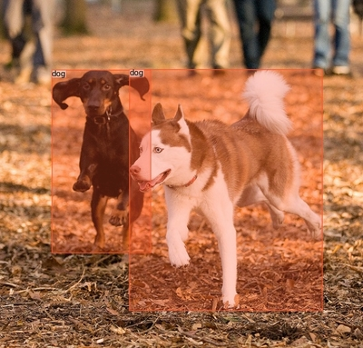
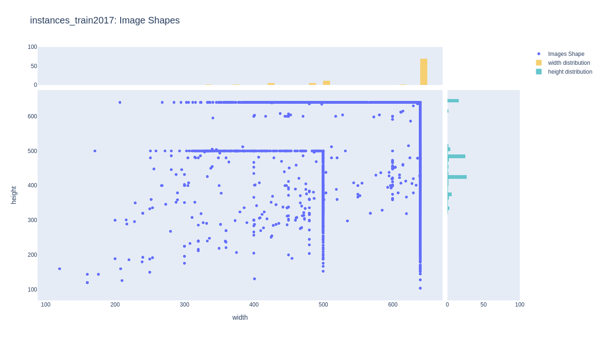
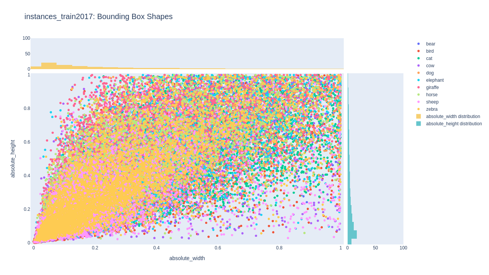
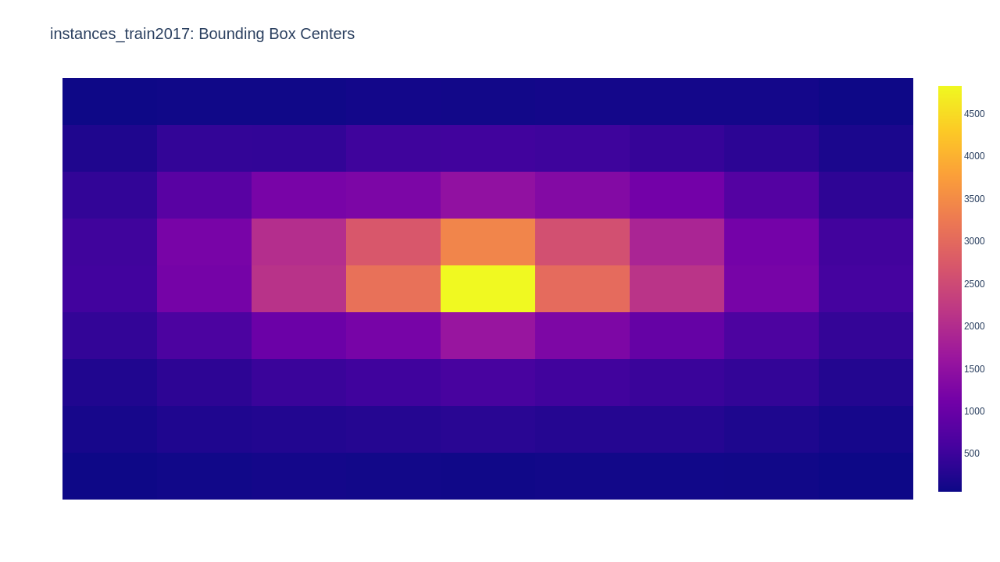
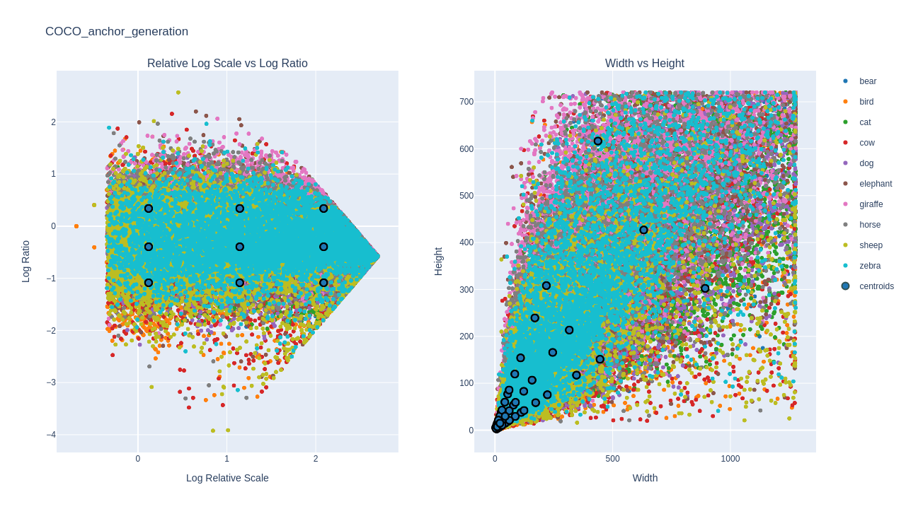
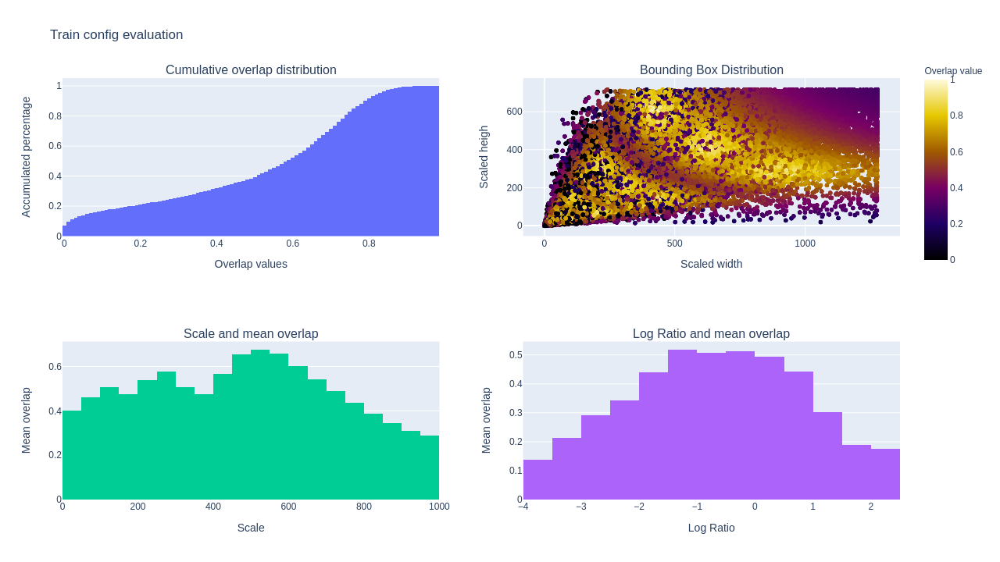

<h1 align="center">
  <div>
    
  </div>
  <b>Pyodi</b><br>
</h1>


<h3 align="center">
  <b>Python Object Detection Insights</b><br>
</h3>

<p align="center">
    <a href="https://www.python.org/">
        
    </a>
    <a href="https://github.com/Gradiant/pyodi/actions?query=workflow%3A%22Continuous+Integration%22">
        
    </a>
    <a href= "https://github.com/Gradiant/pyodi/blob/master/LICENSE">
        
    </a>
</p>


Documentation: https://gradiant.github.io/pyodi

## Introduction

A simple tool for explore your object detection dataset. The goal of this library is to provide simple and intuitive visualizations from your dataset and automatically find the best parameters for generating a specific grid of anchors that can fit you data characteristics

| Component  | Description  |
|---|---|
| [paint annotations](https://gradiant.github.io/pyodi/reference/apps/paint-annotations/)  | paints COCO format annotations and predictions  |
| [ground-truth](https://gradiant.github.io/pyodi/reference/apps/ground-truth/) |  explore your dataset ground truth characteristics |
| [evaluation](https://gradiant.github.io/pyodi/reference/apps/evaluation/)  | evaluates AP and AR for between predictions and ground truth |
| [train-config generation](https://gradiant.github.io/pyodi/reference/apps/train-config-generation/)  | automatically generate anchors for your data  |
| [train-config evaluation](https://gradiant.github.io/pyodi/reference/apps/train-config-evaluation/)  | evaluate the fitness between you data and your anchors  |
| [coco merge](https://gradiant.github.io/pyodi/reference/apps/coco-merge/)  | automatically merge COCO annotation files  |
| [coco split](https://gradiant.github.io/pyodi/reference/apps/coco-split/)  | automatically split COCO annotation files in train and val subsets |
| [crops split](https://gradiant.github.io/pyodi/reference/apps/crops-split/)  | creates a new dataset by splitting images into crops and adapting the annotations file |
| [crops merge](https://gradiant.github.io/pyodi/reference/apps/crops-merge/)  | translate COCO ground truth or COCO predictions crops split into original image coordinates |


## Installation

```bash
pip install pyodi
```

## Usage

Pyodi includes different applications that can help you to extract the most from your dataset. You can download our `TINY_COCO_ANIMAL` dataset from the [releases page](https://github.com/Gradiant/pyodi/releases/tag/v0.1.0) in order to test the example commands. A classic flow could follow the following steps:

### 1. Annotation visualization

With pyodi `paint_annotations` you can easily visualize in a beautiful format your object detection dataset.

```bash
pyodi paint-annotations \
  $TINY_COCO_ANIMAL/annotations/train.json \
  $TINY_COCO_ANIMAL/sample_images \
  $TINY_COCO_ANIMAL/painted_images
```



### 2. Ground truth exploration

It is very recommended to intensively explore your dataset before starting training. The analysis of your images and annotations will allow you to optimize aspects as the optimum image input size for your network or the shape distribution of the bounding boxes. You can use the `ground_truth` app for this task:

```bash
pyodi ground-truth $TINY_COCO_ANIMAL/annotations/train.json
```







### 3. Train config generation

The design of anchors is critical for the performance of one-stage detectors. Pyodi can help you to automatically design a set of anchors that fit your data distribution.

```bash
pyodi train-config generation \
  $TINY_COCO_ANIMAL/annotations/train.json \
  --input-size [1280,720] \
  --n-ratios 3 --n-scales 3
```



### 4. Train config evaluation

Pyodi evaluation app has been designed with the aim of providing a simple tool to understand how well are your anchors matching your dataset. It automatically runs by default after executing `train-config generation` but it can also be run independently with:

```bash
pyodi train-config evaluation \
  $TINY_COCO_ANIMAL/annotations/train.json \
  $TINY_COCO_ANIMAL/resources/anchor_config.py \
  --input-size [1280,720]
```



## Contributing

We appreciate all contributions to improve Pyodi. Please refer to [Contributing guide](.github/CONTRIBUTING.md) for more info.
