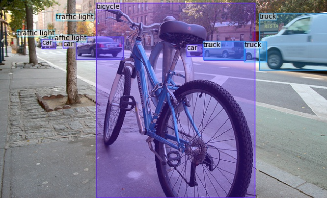
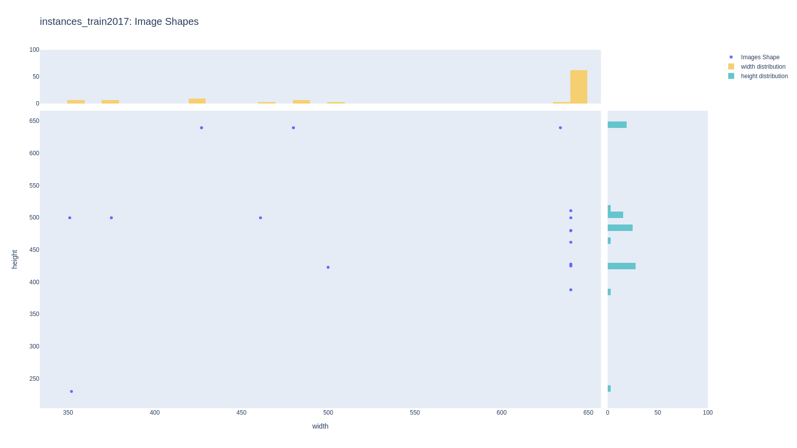
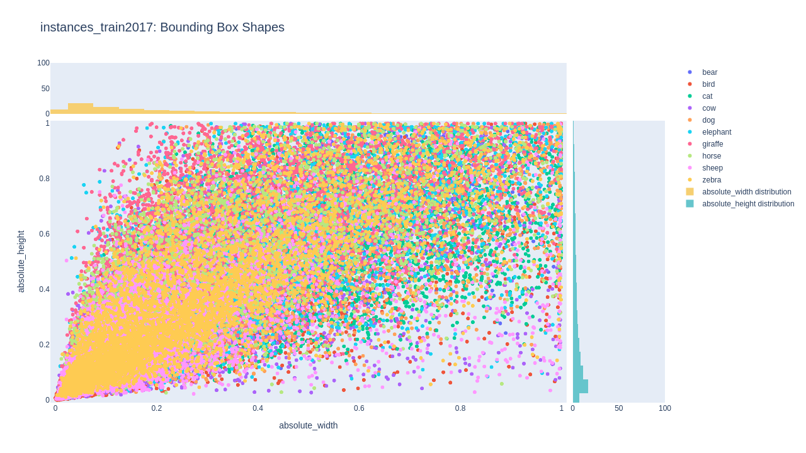
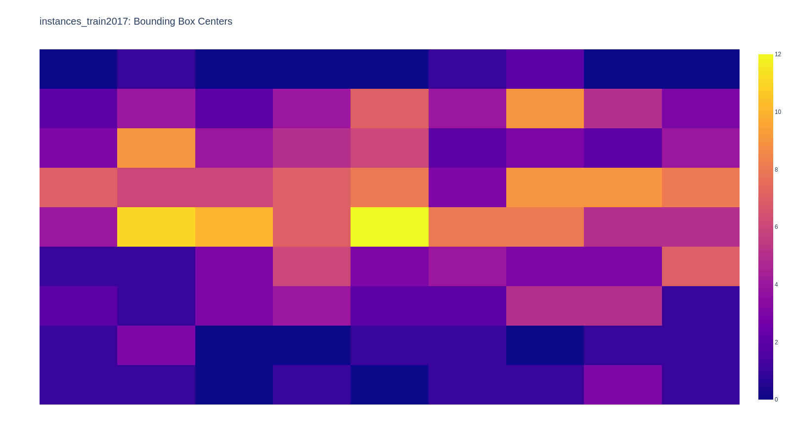
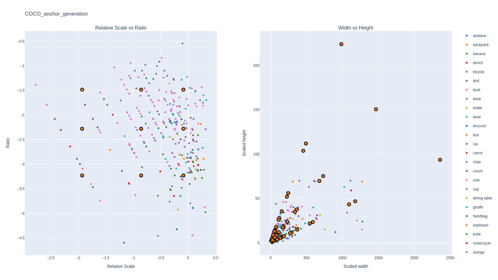
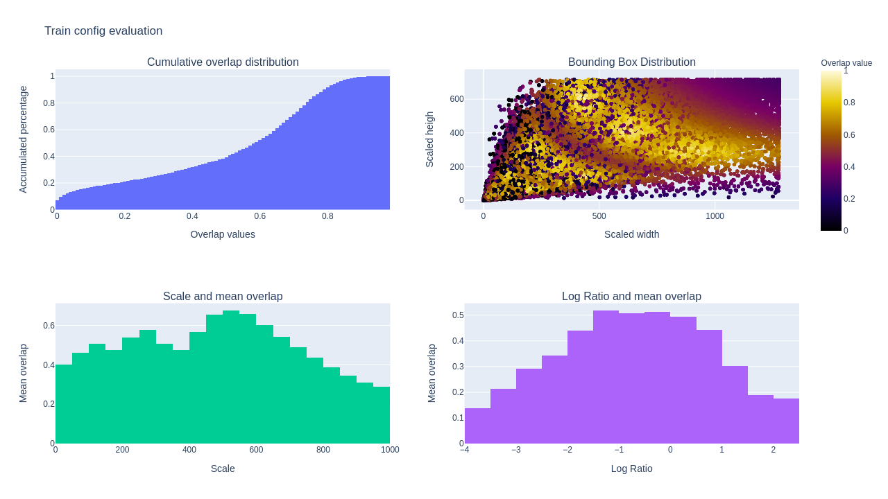

<h1 align="center">
  <b>Pyodi</b><br>
</h1>

<h3 align="center">
  <b>Python Object Detection Insights</b><br>
</h3>

<p align="center">
    <a href="https://www.python.org/">
        
    </a>
    <a href="https://github.com/Gradiant/pyodi/actions?query=workflow%3A%22Continuous+Integration%22">
        
    </a>
    <a href= "https://github.com/AntixK/PyTorch-VAE/blob/master/LICENSE.md">
        
    </a>
</p>

Documentation: https://docs-url.com
## Introduction
A simple tool for explore your object detection dataset. The goal of this library is to provide simple and intuitive visualizations from your dataset and automatically find the best parameters for generating a specific grid of anchors that can fit you data characteristics

| Component  | Description  |
|---|---|
| [paint annotations]()  | paints COCO format annotations and predictions  |
|  [ground-truth]() |  explore your dataset ground truth characteristics |
| [train-config generation]()  | automatically generate anchors for your data  |
| [train-config evaluation]()  | evaluate the fitness between you data and your anchors  |
| [coco merge]()  | automatically merge COCO annotation files  |
| [coco split]()  | automatically split COCO annotation files in train and val subsets |
| [crops split]()  | creates a new dataset by splitting images into crops and adapting the annotations file |
| [crops merge]()  | translate COCO ground truth or COCO predictions crops split into original image coordinates |


## Installation
```bash
git clone https://github.com/Gradiant/pyodi.git
cd pyodi
python setup.py install
```

## Contributing
We appreciate all contributions to improve Pyodi. Please refer to [Contributing guide](.github/CONTRIBUTING.md) for more info.


## Usage

Pyodi includes different applications that can help you to extract the most from your dataset. A classic flow could follow the following steps:

### 1. Annotation visualization

With pyodi `paint_annotations` you can easily visualize in a beautiful format your object detection dataset. You can also use this function to visualize model predictions if they are in COCO predictions format.

```bash
pyodi paint-annotations \
  ../tiny_coco/annotations/instances_train2017.json \
  ../tiny_coco/images/train2017 \
  ./painted_ground_truth
```



### 2. Ground truth exploration

It is very recommended to intensively explore your dataset before starting training. The analysis of your images and annotation will allow you to optimize aspects as the optimum image input size for your network or the shape distribution of the bounding boxes. You can use `ground_truth` for this task:

```bash
pyodi ground-truth ../tiny_coco/annotations/instances_train2017.json
```

The output of this command shows three different kinds of plots. The first of them contains information related with the shape of the images present in the dataset. In this case we can clearly identify two main patterns in this dataset and if we have a look at the histogram, we can see how most of images have 640 pixels width, while as height is more distributed between different values.



We can also observe bounding box distribution, with the possibility of enabling filters by class or sets of classes. This dataset shows a tendency to  rectangular bounding boxes with larger width than height and where most of them embrace areas below the 20% of the total image.


Finally, we can also check where the centers of bounding boxes are most commonly found with respect to the image, which can help us distinguish ROIs in input images. In this case we observe that the objects usually appear in the center of the image.


### 3. Train config generation

The design of anchors is critical for the performance of one-stage detectors. Usually, published models such [Faster R-CNN](https://arxiv.org/abs/1506.01497) or [RetinaNet](https://arxiv.org/abs/1708.02002) include default anchors which has been designed to work with general object detection purpose as COCO dataset. Nevertheless, you might be envolved in different problems which data contains only a few different classes that share similar properties, as the object sizes or shapes, this would be the case for a drone detection dataset such [Drone vs Bird](https://wosdetc2020.wordpress.com/). You can exploit this knowledge by designing anchors that specially fit the distribution of your data, optimizing the probability of matching ground truth bounding boxes with generated anchors, which can result in an increase in the performance of your model. At the same time, you can reduce the number of anchors you use to boost inference and training time.

With pyodi `train-config generation` you can automatically find a set of anchors that fit your data distribution. For this we can adjust the number of scales and ratios the strides of anchors in the multiple feature levels and even the anchor base size for each level. The input size parameter determines the model input size and automatically reshapes images and annotations sizes to it.

```bash
pyodi train-config generation \
  ../TINY_COCO_ANIMAL/annotations/instances_train2017.json \
  --input-size 1280 720 \
  --n-ratios 3 \
  --n-scales 3
```

Result of this command shows two different plots. In the left side we can visualize a comparison between objects and their assigned base anchor. Each object is assigned to one pyramid level depending on its size. The x axis shows the log scale between the object and the base anchor that represents that pyramid level and the y axis represents the ratio between scale ratios. We use log scale to ease visualization. The 9 different centroids that we observe in the graph are all combinations between the three scales and the three ratios found. The plot in the right contains the same information but with respect to bounding boxes width and heights. There, the centroids are the result of applying the previous 9 configurations to each base anchor of the feature levels.



Proposed anchors are also attached in a Json file that follows [mmdetection anchors](https://github.com/open-mmlab/mmdetection/blob/master/mmdet/core/anchor/anchor_generator.py#L10) format:

```python
anchor_generator=dict(
    type='AnchorGenerator',
    scales=[1.12, 3.13, 8.0],
    ratios=[0.33, 0.67, 1.4],
    strides=[4, 8, 16, 32, 64],
    base_sizes=[4, 8, 16, 32, 64],
)
```

### 4. Train config evaluation

Pyodi evaluation app has been designed with the aim of providing a simple tool to understand how well are your anchors matching your dataset. It automatically runs by default after executing `train-config generation` but it can also be run independently with:

```bash
pyodi train-config evaluation \
  ../TINY_COCO_ANIMAL/annotations/instances_train2017.json \
  resources/anchor_config.py \
  --input-size 1280 720
```

Results show us 4 different plots useful to evaluate the match between our ground truth bounding boxes and generated anchors.

- The **upper left** plot shows the cumulative overlap distribution. There we can see that almost 40% of the bounding boxes have a maximum overlap below 0.5 with some of the generated anchors.

- The **upper right** plot helps us to understand if there are certain bounding boxes we migth be missing. In this case we observe that we are having problems to match large bounding boxes with proposed anchors.

- The **bottom left** one is an histogram that is intended to show how mean overlap is distributed along the different bounding box scale values. Once again we observe that the overlap decreases for larger scale values.

- The **bottom right** plot shows a similar histogram but in this case the x axis represents log ratio of the bounding boxes. Boxes with large ratios, this is, large differences between their width and height, are harder to match.




## Tests

The test suite can be run using pytest:
```bash
pytest tests
```
